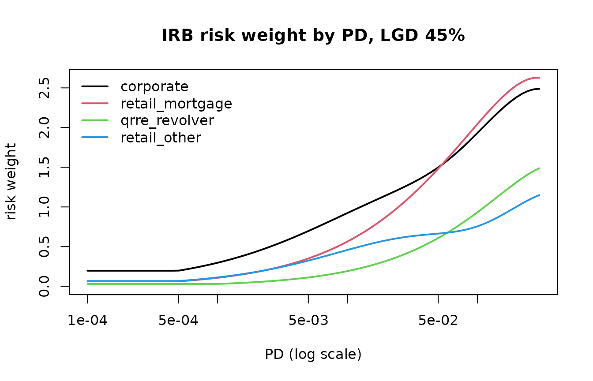

# Expected loss and regulatory capital

This vignette takes PD, LGD and EAD from the previous two and turns them
into expected loss, IRB risk weights, capital with the output floor and
accounting ECL, on the bundled `scr_demo_portfolio`.

``` r

library(scorecraft)
library(data.table)
cfg <- scr_config(verbose = FALSE, nthread = 1)
```

## 1. Expected and unexpected loss

The loss a portfolio produces in an average year is its **expected
loss**, `EL = PD * LGD * EAD`; it is a cost of doing business and is
covered by provisions and pricing. The loss in a bad year exceeds that
average, and the gap between a high quantile of the loss distribution
and its mean is the **unexpected loss** that capital must absorb. The
IRB risk-weight function turns a through-the-cycle PD into the PD of a
year at the 99.9 % quantile of a one-factor model, and charges capital
for the difference between the loss at that quantile and the expected
loss. Every number that a regime fixes in that calculation (PD and LGD
floors, asset correlations, the maturity rule, the confidence level, the
standardised risk weights that the output floor compares against) lives
in a table returned by
[`scr_irb_params()`](https://evandeilton.github.io/scorecraft/reference/scr_irb_params.md)
and selected by a preset; nothing is hard-coded in the functions that
consume it, and an edited table is recorded as such on every object
built from it.

## 2. The parameter tables

[`scr_irb_params()`](https://evandeilton.github.io/scorecraft/reference/scr_irb_params.md)
returns every regime-specific number as a table; the print summarises
them.

``` r

p <- scr_irb_params("bcb")
p
#> <scr_irb_params> framework: bcb
#>   Resolucao BCB 303/2023 (IRB) and 229/2022 (standardised); values as tables, editable
#>   PD floors:   corporate 0.05% | bank 0.05% | sovereign none | retail_mortgage 0.05% | qrre_transactor 0.05% | qrre_revolver 0.10% | retail_other 0.05% 
#>   LGD floors (unsecured):  corporate 25% | retail_mortgage n/a | qrre 50% | retail_other 30% 
#>   F-IRB LGD: senior_unsecured 75% | priority_claim 45% | subordinated 75% | secured_financial 0% | secured_receivables 20% | secured_real_estate 20% | secured_other 25%
#>   CCF (standardised): uncond_cancellable 10% | commitment 40% | nif_ruf 50% | direct_substitute 100% | own-estimate floor 50% of the standardised value
#>   correlation: corporate 0.12-0.24 (k=50) | mortgage 0.15 | QRRE 0.04 | other retail 0.03-0.16 (k=35) | FI x1.25 | SME adj 0.04 (BRL m 15-300)
#>   confidence 0.999 | scaling factor 1 | M default 2.5 in [1, 5] | output floor 72.5% | SA risk weights: 26 rows
p$pd_floor
#>        asset_class floor
#>             <char> <num>
#> 1:       corporate 5e-04
#> 2:            bank 5e-04
#> 3:       sovereign    NA
#> 4: retail_mortgage 5e-04
#> 5: qrre_transactor 5e-04
#> 6:   qrre_revolver 1e-03
#> 7:    retail_other 5e-04
```

The presets differ in a handful of cells (`"bcb"` takes its values from
Resolução BCB 303/2023, `"basel3_final"` from the consolidated Basel
Framework, whose CRE31 chapter is the risk-weight function). The visible
differences are the supervisory LGD table of the foundation approach and
the firm-size bounds of the SME correlation adjustment.

``` r

p_b3 <- scr_irb_params("basel3_final")
rbind(cbind(framework = "bcb", p$lgd_firb), cbind(framework = "basel3_final", p_b3$lgd_firb))
#>        framework                      claim   lgd
#>           <char>                     <char> <num>
#>  1:          bcb           senior_unsecured  0.75
#>  2:          bcb             priority_claim  0.45
#>  3:          bcb               subordinated  0.75
#>  4:          bcb          secured_financial  0.00
#>  5:          bcb        secured_receivables  0.20
#>  6:          bcb        secured_real_estate  0.20
#>  7:          bcb              secured_other  0.25
#>  8: basel3_final senior_unsecured_corporate  0.40
#>  9: basel3_final        senior_unsecured_fi  0.45
#> 10: basel3_final               subordinated  0.75
#> 11: basel3_final          secured_financial  0.00
#> 12: basel3_final        secured_receivables  0.20
#> 13: basel3_final        secured_real_estate  0.20
#> 14: basel3_final              secured_other  0.25
rbindlist(list(c(framework = "bcb", p$correlation$sme), c(framework = "basel3_final", p_b3$correlation$sme)))
#>       framework    lo    hi   adj   unit
#>          <char> <num> <num> <num> <char>
#> 1:          bcb    15   300  0.04  BRL m
#> 2: basel3_final     5    50  0.04  EUR m
```

Any cell can be edited and the object passed back through `params`; the
function that receives it flags `params_modified` in its model card.

## 3. One exposure: `scr_el()` and `scr_irb_rw()`

Expected loss is the primitive. Defaulted exposures replace `PD * LGD`
with the best estimate of expected loss, `ELBE`.

``` r

scr_el(c(0.01, 0.02), 0.45, c(1000, 2000))
#> [1]  4.5 18.0
scr_el(0.02, 0.45, 1000, defaulted = TRUE, elbe = 0.6)
#> [1] 600
```

[`scr_irb_rw()`](https://evandeilton.github.io/scorecraft/reference/scr_irb_rw.md)
returns the intermediate quantities of the risk-weight function, not
only the answer: the PD and LGD after floors, the maturity after
clipping, the correlation `r`, the maturity adjustment `ma` and the
capital requirement `k`. A corporate exposure at PD 1 %, LGD 45 % and
maturity 2.5 years carries a risk weight of 92.32 %.

``` r

scr_irb_rw(0.01, 0.45, m = 2.5, asset_class = "corporate", params = p)
#>    pd_used lgd_used     m         r         b      ma          k       rw
#>      <num>    <num> <num>     <num>     <num>   <num>      <num>    <num>
#> 1:    0.01     0.45   2.5 0.1927837 0.1374861 1.25981 0.07385344 0.923168
#>         rwa
#>       <num>
#> 1: 0.923168
rbind(
  mortgage     = scr_irb_rw(0.01, 0.20, asset_class = "retail_mortgage", params = p),
  qrre         = scr_irb_rw(0.02, 0.80, asset_class = "qrre_revolver", params = p),
  retail_other = scr_irb_rw(0.02, 0.50, asset_class = "retail_other", params = p)
)[, .(pd_used, lgd_used, r, k, rw)]
#>    pd_used lgd_used          r          k        rw
#>      <num>    <num>      <num>      <num>     <num>
#> 1:    0.01      0.2 0.15000000 0.02005295 0.2506619
#> 2:    0.02      0.8 0.04000000 0.04113480 0.5141850
#> 3:    0.02      0.5 0.09455609 0.05154350 0.6442938
```

Retail classes have no maturity adjustment (`b` is `NA`, `ma` is one),
so for them `K` is exactly `LGD` times the distance between the stressed
and the unconditional PD.
[`scr_pd_stress()`](https://evandeilton.github.io/scorecraft/reference/scr_pd_stress.md)
is that stressed PD, and at `q = 0.999` with the regulatory correlation
it reproduces `k` to machine precision.

``` r

o <- scr_irb_rw(0.02, 0.50, asset_class = "retail_other", params = p)
c(k = o$k, by_hand = 0.5 * (scr_pd_stress(0.02, o$r, 0.999) - 0.02))
#>         k   by_hand 
#> 0.0515435 0.0515435
scr_pd_stress(0.02, rho = 0.15, q = c(0.5, 0.95, 0.99, 0.999))
#> [1] 0.01295348 0.06219237 0.10558734 0.17632894
```

The shape of the function differs by asset class because the correlation
does: fixed for mortgages (0.15) and revolving retail (0.04), decreasing
in PD for corporates and other retail. Plotted at a common LGD of 45 %:

``` r

grid <- exp(seq(log(1e-4), log(0.3), length.out = 80))
classes <- c("corporate", "retail_mortgage", "qrre_revolver", "retail_other")
curves <- lapply(classes, function(a) scr_irb_rw(grid, 0.45, asset_class = a, params = p)$rw)
plot(grid, curves[[1]], type = "n", log = "x", ylim = c(0, max(unlist(curves))),
     xlab = "PD (log scale)", ylab = "risk weight", main = "IRB risk weight by PD, LGD 45 %")
for (i in seq_along(classes)) lines(grid, curves[[i]], lwd = 2, col = i)
legend("topleft", classes, col = seq_along(classes), lwd = 2, bty = "n")
```



The flat start of every curve is the PD floor: below it the risk weight
no longer falls with the PD. The `floors_hit` attribute counts the rows
where each floor was binding, and `apply_floors = FALSE` shows what the
function would return without them.

``` r

r_floored <- scr_irb_rw(grid, 0.45, asset_class = "retail_other", params = p)
attr(r_floored, "floors_hit")
#>        floor     n
#>       <char> <int>
#> 1:  pd_floor    16
#> 2: lgd_floor     0
#> 3:   m_floor     0
#> 4:     m_cap     0
r_raw <- scr_irb_rw(grid, 0.45, asset_class = "retail_other", params = p, apply_floors = FALSE)
data.table(pd = grid, rw_floored = r_floored$rw, rw_no_floor = r_raw$rw)[pd < 6e-4][c(1, 5, 10, 15)]
#>              pd rw_floored rw_no_floor
#>           <num>      <num>       <num>
#> 1: 0.0001000000 0.06629119  0.01834523
#> 2: 0.0001499881 0.06629119  0.02554640
#> 3: 0.0002489589 0.06629119  0.03839309
#> 4: 0.0004132365 0.06629119  0.05720678
# LGD floors by collateral class: an own estimate of 10 % is lifted to the unsecured floor
scr_irb_rw(0.01, 0.10, asset_class = c("retail_other", "qrre_revolver", "corporate", "retail_mortgage"), params = p)$lgd_used
#> [1] 0.30 0.50 0.25 0.10
```

## 4. The standardised comparison

The output floor compares the IRB result with a fraction of what the
standardised approach would require, so the same book needs a
standardised risk weight per exposure.
[`scr_sa_rw()`](https://evandeilton.github.io/scorecraft/reference/scr_sa_rw.md)
looks it up in `params$sa_rw`: regulatory retail, mortgages by
loan-to-value band, corporates by rating bucket or the SME weight,
defaulted exposures by provision ratio.

``` r

scr_sa_rw(c("retail_other", "retail_mortgage", "retail_mortgage", "corporate", "corporate", "corporate_sme"),
          ltv = c(NA, 0.55, 0.95, NA, NA, NA), rating = c(NA, NA, NA, "A+", NA, NA))
#> [1] 0.75 0.25 0.50 0.50 1.00 0.85
scr_sa_rw("retail_other", defaulted = TRUE, provision_ratio = c(0.1, 0.3))
#> [1] 1.5 1.0
p$sa_rw[asset_class == "retail_mortgage" & sub_class == "standard"]
#>        asset_class sub_class ltv_lo ltv_hi    rw
#>             <char>    <char>  <num>  <num> <num>
#> 1: retail_mortgage  standard    0.0    0.5  0.20
#> 2: retail_mortgage  standard    0.5    0.6  0.25
#> 3: retail_mortgage  standard    0.6    0.8  0.30
#> 4: retail_mortgage  standard    0.8    0.9  0.40
#> 5: retail_mortgage  standard    0.9    1.0  0.50
#> 6: retail_mortgage  standard    1.0    Inf  0.70
```

## 5. The portfolio: `scr_capital()`

`scr_demo_portfolio` holds 5,000 exposures in six segments that map one
to one onto the asset classes; PD is a grade PD and LGD a pool value, so
segment by grade is homogeneous in PD and LGD, while maturity varies
inside the corporate pools (section 6 comes back to this). About 3 % of
the rows are in default with an `elbe` and a provision.

``` r

d <- scr_demo_portfolio
table(d$segment, d$asset_class)
#>                   
#>                    corporate corporate_sme qrre_revolver qrre_transactor
#>   cards_revolver           0             0           800               0
#>   cards_transactor         0             0             0             500
#>   corporate_large        500             0             0               0
#>   corporate_sme            0           700             0               0
#>   mortgages                0             0             0               0
#>   retail_loans             0             0             0               0
#>                   
#>                    retail_mortgage retail_other
#>   cards_revolver                 0            0
#>   cards_transactor               0            0
#>   corporate_large                0            0
#>   corporate_sme                  0            0
#>   mortgages                   1000            0
#>   retail_loans                   0         1500
cap <- scr_capital(d, segment = "segment", asset_class = "asset_class", m = "m",
                   defaulted = "defaulted", elbe = "elbe", provisions = "provision",
                   ltv = "ltv", rating = "rating", sales = "sales", transactor = "transactor",
                   grade = "grade", id = "id", config = cfg, keep_rows = TRUE)
cap
#> <scr_capital> bcb | airb | 5,000 exposures in 6 segments
#>   EAD 1,940,402,792 | EL 31,028,477 (1.60%) | RWA IRB 1,214,315,257 | density 62.6% | capital (8.0%) 97,145,221
#>   standardised RWA 1,553,528,212 | IRB/SA 0.782 | output floor 72.5%: not binding (headroom 88,007,303)
#>   provisions 43,425,571 vs EL: shortfall 0 | excess 12,397,094 | tier 2 add-back 7,285,892 (cap 7,285,892)
#>   floors: pd 194 rows, RWA 5,221,058 | lgd 0 rows, RWA         0 | m 0 rows, RWA         0 | HHI 0.00231 (n_eff 433, max share 1.19%)
#>   top segments by RWA:
#>     corporate_large        n 500     EAD 1,451,911,238  RW  65.1%  RWA 944,938,904     IRB/SA 0.77
#>     corporate_sme          n 700     EAD 302,516,540    RW  79.2%  RWA 239,492,431     IRB/SA 0.92
#>     mortgages              n 1,000   EAD 165,305,905    RW  12.6%  RWA 20,764,980      IRB/SA 0.37
#>     retail_loans           n 1,500   EAD 15,592,011     RW  44.5%  RWA 6,935,236       IRB/SA 0.59
#>     cards_revolver         n 800     EAD 3,282,347      RW  54.2%  RWA 1,777,936       IRB/SA 0.71
#>   sensitivity: vasicek_q0.99 +95.8% | vasicek_q0.95 +55.7% | r_x1.25 +26.8%
```

### Totals and the reconciliation by segment

Every figure on the print is in `cap$totals`, and `cap$segments` breaks
it down: EAD-weighted inputs, the IRB and standardised risk-weighted
assets side by side, expected loss and provisions.

``` r

with(cap$totals, data.table(ead, el, el_rate, rwa_irb, rwa_sa, irb_sa_ratio, density, capital))
#>           ead       el    el_rate    rwa_irb     rwa_sa irb_sa_ratio   density
#>         <num>    <num>      <num>      <num>      <num>        <num>     <num>
#> 1: 1940402792 31028477 0.01599074 1214315257 1553528212      0.78165 0.6258058
#>     capital
#>       <num>
#> 1: 97145221
cap$segments[, .(segment, n, ead, pd_mean, lgd_mean, rw, rwa_irb, irb_sa_ratio, el, provisions, shortfall_excess)]
#>             segment     n        ead    pd_mean lgd_mean        rw     rwa_irb
#>              <char> <int>      <num>      <num>    <num>     <num>       <num>
#> 1:  corporate_large   500 1451911238 0.03359715     0.40 0.6508242 944938904.4
#> 2:    corporate_sme   700  302516540 0.06973651     0.42 0.7916672 239492431.3
#> 3:        mortgages  1000  165305905 0.01792392     0.15 0.1256155  20764979.8
#> 4:     retail_loans  1500   15592011 0.05400681     0.45 0.4447942   6935236.3
#> 5:   cards_revolver   800    3282347 0.07501589     0.75 0.5416660   1777935.7
#> 6: cards_transactor   500    1794751 0.03000090     0.70 0.2260868    405769.5
#>    irb_sa_ratio         el provisions shortfall_excess
#>           <num>      <num>      <num>            <num>
#> 1:    0.7729808 20926478.3   30840652      9914173.739
#> 2:    0.9233544  9087003.5   10039600       952596.493
#> 3:    0.3672066   421450.8    1963358      1541907.188
#> 4:    0.5866356   374260.3     396848        22587.723
#> 5:    0.7118514   181708.6     142177       -39531.608
#> 6:    0.4907211    37575.5      42936         5360.503
```

The `irb_sa_ratio` column says where the IRB approach saves the most
against the standardised one; mortgages sit far below the 72.5 % line on
their own, the large corporate book just above it and the SME book well
above, and the output floor is applied to the total, not by segment.

### Floors and the output-floor bridge

`cap$floors` measures each input floor by the rows it binds, their EAD
and the risk-weighted assets it adds. Here only the PD floor bites (the
two safest grades start below it on purpose), and the bridge from the
unfloored IRB figure to the reported one reads:

``` r

cap$floors
#>        floor n_hit   ead_hit delta_rwa
#>       <char> <int>     <num>     <num>
#> 1:  pd_floor   194 110745561   5221058
#> 2: lgd_floor     0         0         0
#> 3:   m_floor     0         0         0
with(cap$totals, data.table(
  step  = c("rwa_irb_no_floors", "input_floors", "rwa_irb", "rwa_sa", "output_floor_rwa", "rwa_reported"),
  value = c(rwa_irb_no_floors, rwa_irb - rwa_irb_no_floors, rwa_irb, rwa_sa, rwa_floor, rwa_reported)))
#>                 step      value
#>               <char>      <num>
#> 1: rwa_irb_no_floors 1209094199
#> 2:      input_floors    5221058
#> 3:           rwa_irb 1214315257
#> 4:            rwa_sa 1553528212
#> 5:  output_floor_rwa 1126307953
#> 6:      rwa_reported 1214315257
with(cap$totals, data.table(floor_binding, headroom))
#>    floor_binding headroom
#>           <lgcl>    <num>
#> 1:         FALSE 88007303
```

`rwa_reported` is the larger of the IRB figure and
`output_floor * rwa_sa`; `headroom` is the distance to the floor,
negative when it binds.

### Expected loss against provisions

Regulatory EL is compared with the provision stock. A shortfall is
deducted from capital; an excess counts as tier 2 up to 0.6 % of the IRB
risk-weighted assets, which is why `tier2_addback` can be smaller than
`excess`.

``` r

with(cap$totals, data.table(el, provisions, shortfall, excess, tier2_cap, tier2_addback))
#>          el provisions shortfall   excess tier2_cap tier2_addback
#>       <num>      <num>     <num>    <num>     <num>         <num>
#> 1: 31028477   43425571         0 12397094   7285892       7285892
```

### Sensitivity

The grid re-runs the whole function under fixed shocks. The two Vasicek
rows stress every performing PD with
[`scr_pd_stress()`](https://evandeilton.github.io/scorecraft/reference/scr_pd_stress.md)
at the exposure’s own correlation and feed the stressed PD back into the
function, so that the correlation follows the PD; they are the closest
the grid comes to a bad-year capital figure.

``` r

cap$sensitivity
#>             shock        rwa      delta    delta_pct
#>            <char>      <num>      <num>        <num>
#>  1:          base 1214315257          0  0.000000000
#>  2:      pd_x1.10 1256949940   42634684  0.035110062
#>  3:      pd_x1.25 1315374005  101058749  0.083222827
#>  4:      pd_x1.50 1401061020  186745763  0.153786887
#>  5:  lgd_plus_5pp 1380658748  166343491  0.136985424
#>  6:     ead_x1.10 1335746783  121431526  0.100000000
#>  7:      no_floor 1209094199   -5221058 -0.004299591
#>  8:       r_x1.25 1540264244  325948987  0.268422047
#>  9: vasicek_q0.95 1890754479  676439222  0.557054042
#> 10: vasicek_q0.99 2377857720 1163542463  0.958188128
```

## 6. The same numbers in SQL

The production query does not need a normal quantile: the constants of
every pool (PD, LGD, correlation, `K`, `RW`, all after floors) are
computed in R and emitted as a `pool_params` CTE, and the exposure table
is joined to it on segment and grade. Defaulted rows use `ELBE * EAD`
and `K = max(0, LGD - ELBE)` from their own columns.

``` r

sql <- scr_sql(cap, table = "portfolio", dialect = "duckdb")
cat(sql[c(4:9, 12:15)], sep = "\n")
#> -- CTE pool_params: PD, LGD, correlation, K and RW per pool, computed in R
#> --   (floors applied; no normal quantile needed at run time).
#> -- CTE exposure_capital: el = pd * lgd * ead, rwa = 12.5 * k * ead per exposure;
#> --   rows with defaulted = 1 use ELBE * ead and K = max(0, LGD - ELBE).
#> -- NOTE: at least one pool is not homogeneous: its constants are EAD-weighted, so
#> --   EL and RWA are exact per pool and approximate per exposure. Pass `grade` for finer pools.
#> WITH pool_params AS (
#>   SELECT 'cards_revolver' AS segment, 'G01' AS grade, 0.001 AS pd, 0.75 AS lgd, 0.04 AS r, 0.0036114040962495642 AS k, 0.045142551203119552 AS rw
#>   UNION ALL
#>   SELECT 'cards_revolver' AS segment, 'G02' AS grade, 0.001 AS pd, 0.75 AS lgd, 0.04 AS r, 0.0036114040962495642 AS k, 0.045142551203119552 AS rw
cat(tail(sql, 21), sep = "\n")
#>   SELECT
#>     e.id,
#>     e.segment,
#>     e.grade,
#>     e.ead AS ead,
#>     CASE WHEN e.defaulted = 1 THEN COALESCE(e.elbe, e.lgd) * e.ead ELSE p.pd * p.lgd * e.ead END AS el,
#>     CASE WHEN e.defaulted = 1 THEN (CASE WHEN e.lgd - COALESCE(e.elbe, e.lgd) > 0 THEN e.lgd - COALESCE(e.elbe, e.lgd) ELSE 0 END) ELSE p.k END AS k
#>   FROM portfolio e
#>   JOIN pool_params p ON e.segment = p.segment AND e.grade = p.grade
#> )
#> 
#> SELECT
#>     id,
#>     segment,
#>     grade,
#>     ead,
#>     el,
#>     k,
#>     12.5 * k AS rw,
#>     12.5 * k * ead AS rwa
#> FROM exposure_capital;
```

The retail pools are homogeneous, so the query reproduces R row by row;
the corporate pools carry a maturity that varies inside the pool, so
their constants are EAD-weighted and the match is exact at pool level
(the header of the SQL says so). Both facts can be checked on DuckDB.

``` r

con <- DBI::dbConnect(duckdb::duckdb(), config = list(threads = "1"))
DBI::dbWriteTable(con, "portfolio", d)
got <- DBI::dbGetQuery(con, paste(sql, collapse = "\n"))
got <- got[match(d$id, got$id), ]
ex <- cap$exposures
retail <- !d$segment %in% c("corporate_large", "corporate_sme")
data.table(id = d$id, segment = d$segment, el_r = ex$el, el_sql = got$el, rwa_r = ex$rwa, rwa_sql = got$rwa)[retail][1:4]
#>        id        segment      el_r    el_sql     rwa_r   rwa_sql
#>    <char>         <char>     <num>     <num>     <num>     <num>
#> 1: E00001   retail_loans  18.65707  18.65707  2386.003  2386.003
#> 2: E00002      mortgages 256.42922 256.42922 36989.679 36989.679
#> 3: E00003 cards_revolver  99.56714  99.56714  2210.792  2210.792
#> 4: E00004      mortgages  68.02380  68.02380 12261.888 12261.888
c(el = all.equal(got$el[retail], ex$el[retail]), rwa = all.equal(got$rwa[retail], ex$rwa[retail]))
#>   el  rwa 
#> TRUE TRUE
agg <- DBI::dbGetQuery(con, paste(scr_sql(cap, table = "portfolio", dialect = "duckdb", level = "portfolio"), collapse = "\n"))
agg <- agg[match(cap$segments$segment, agg$segment), ]
c(rwa = all.equal(agg$rwa, cap$segments$rwa_irb), el = all.equal(agg$el, cap$segments$el))
#>  rwa   el 
#> TRUE TRUE
DBI::dbDisconnect(con, shutdown = TRUE)
```

## 7. Accounting expected credit loss: `scr_ecl()`

[`scr_ecl()`](https://evandeilton.github.io/scorecraft/reference/scr_ecl.md)
computes the discrete-time expected credit loss: a survival-weighted sum
of marginal monthly hazards times LGD and EAD, discounted at the
effective interest rate. With a flat hazard, no discounting and no
prepayment the sum collapses to the closed form
`LGD * EAD * (1 - (1 - h)^T)`.

``` r

cfg_none <- scr_config(verbose = FALSE, nthread = 1, ecl_discount = "none")
h <- 0.01; lgd <- 0.4; ead <- 1000
e1 <- scr_ecl(h, lgd, ead, t_max = 36L, config = cfg_none)
c(ecl_12m = e1$totals$ecl_12m, closed_form = lgd * ead * (1 - (1 - h)^12),
  ecl_life = e1$totals$ecl_life, closed_form = lgd * ead * (1 - (1 - h)^36))
#>     ecl_12m closed_form    ecl_life closed_form 
#>    45.44605    45.44605   121.43471   121.43471
```

On the portfolio, the annual grade PD becomes a flat monthly hazard, the
stage is allocated by the rule (days past due, or a doubling of the PD
since origination), and three scenarios are weighted. The `z` shock
moves every hazard through the one-factor model; `lgd_add` and
`ead_mult` do what their names say.

``` r

hz <- 1 - (1 - d$pd)^(1 / 12)
ecl <- scr_ecl(hz, d$lgd, d$ead, eir = d$eir, dpd = d$dpd, pd_orig = d$pd_orig, t_max = 36L,
               segment = d$segment, id = d$id,
               scenarios = list(base = list(), downturn = list(z = -1, lgd_add = 0.05), upturn = list(z = 1)),
               weights = c(0.5, 0.3, 0.2), config = cfg)
ecl
#> <scr_ecl> 5,000 exposures | ECL 31,844,876 | coverage 1.64% | 12-month horizon 12 of 36 months | discount: eir
#>   stage rule: dpd >= 90 -> stage 3; dpd >= 30 or PD ratio >= 2 -> stage 2
#>   stage 1  n 4,304   EAD 1,687,138,403  ECL 7,929,306    coverage 0.47%
#>   stage 2  n 542     EAD 201,418,836    ECL 2,448,913    coverage 1.22%
#>   stage 3  n 154     EAD 51,845,553     ECL 21,466,657   coverage 41.41%
#>   12-month 30,364,216 | lifetime 43,365,170 | scenarios: base 0.50, downturn 0.30, upturn 0.20
ecl$scenarios
#>    scenario weight  ecl_12m ecl_life      ecl
#>      <char>  <num>    <num>    <num>    <num>
#> 1:     base    0.5 28846459 41112620 30230826
#> 2: downturn    0.3 38666873 60477202 41191373
#> 3:   upturn    0.2 21704624 23328500 21860257
ecl$stages
#> Key: <stage>
#>    stage     n        ead    ecl_12m ecl_life      ecl    coverage
#>    <int> <int>      <num>      <num>    <num>    <num>       <num>
#> 1:     1  4304 1687138403  7929306.1 19449600  7929306 0.004699855
#> 2:     2   542  201418836   968252.8  2448913  2448913 0.012158310
#> 3:     3   154   51845553 21466657.4 21466657 21466657 0.414050119
```

Accounting ECL and regulatory EL measure different things and are not
expected to agree: the ECL of stage 2 is a lifetime figure, the ECL of
stage 3 is `LGD * EAD` rather than `ELBE * EAD`, and the scenario
weights tilt the accounting number. Laying the two side by side per
segment is nevertheless the first table a reconciliation asks for.

``` r

merge(cap$segments[, .(segment, ead, el_regulatory = el, provisions)],
      ecl$segments[, .(segment, ecl_accounting = ecl, share_stage2, share_stage3)], by = "segment")[order(-ead)]
#>             segment        ead el_regulatory provisions ecl_accounting
#>              <char>      <num>         <num>      <num>          <num>
#> 1:  corporate_large 1451911238    20926478.3   30840652    21161783.28
#> 2:    corporate_sme  302516540     9087003.5   10039600     9516734.43
#> 3:        mortgages  165305905      421450.8    1963358      531916.08
#> 4:     retail_loans   15592011      374260.3     396848      406081.75
#> 5:   cards_revolver    3282347      181708.6     142177      190006.99
#> 6: cards_transactor    1794751       37575.5      42936       38353.51
#>    share_stage2 share_stage3
#>           <num>        <num>
#> 1:    0.0960000   0.02600000
#> 2:    0.1114286   0.04000000
#> 3:    0.1020000   0.01000000
#> 4:    0.1153333   0.03466667
#> 5:    0.1150000   0.05250000
#> 6:    0.0980000   0.01800000
c(el_regulatory = cap$totals$el, ecl_accounting = ecl$totals$ecl, provisions = cap$totals$provisions)
#>  el_regulatory ecl_accounting     provisions 
#>       31028477       31844876       43425571
```

## 8. Deliverables

[`scr_export()`](https://evandeilton.github.io/scorecraft/reference/scr_export.md)
writes one workbook with the summary, the configuration and every table
of the object, plus the SQL file.

``` r

out <- file.path(tempdir(), "scorecraft-capital")
cap <- scr_export(cap, out, stamp = FALSE)
basename(unlist(cap$files))
#> [1] "capital_bcb.xlsx"    "sql_capital_bcb.sql"
openxlsx::getSheetNames(cap$files$xlsx)
#>  [1] "Capital_Summary"         "Capital_Config"         
#>  [3] "Segments_Reconciliation" "Pools"                  
#>  [5] "Floors_Impact"           "Output_Floor_Bridge"    
#>  [7] "Sensitivity"             "Concentration"          
#>  [9] "EL_vs_Provisions"        "Exposures"              
#> [11] "Model_Card"              "Decision_Ledger"
```

## 9. The ledger and the model card

Every choice the function made on the caller’s behalf is a row of the
ledger: the preset and approach, where the inputs came from, how many
rows each floor touched, whether the output floor binds, and the
provision comparison. The model card carries the numbers a validator
needs to reproduce the run, including whether the parameter tables were
edited.

``` r

cap$ledger[, .(action, detail)]
#>          action
#>          <char>
#> 1:    framework
#> 2:       inputs
#> 3:       floors
#> 4: output_floor
#> 5:   provisions
#>                                                                                       detail
#>                                                                                       <char>
#> 1:                                                       bcb | approach airb | params preset
#> 2:                  pd: column | lgd: column | ead: column | asset_class: column asset_class
#> 3:                     pd floor on 194 rows, lgd floor on 0 rows, maturity clipped on 0 rows
#> 4:                                                72.5% of the standardised RWA: not binding
#> 5: EL 31028477 vs provisions 43425571: shortfall 0, excess 12397094, tier 2 add-back 7285892
mc <- cap$model_card
keys <- c("framework", "approach", "params_modified", "pd_source", "n_exposures", "n_defaulted",
          "n_pools", "rwa_irb", "rwa_sa", "output_floor_binding", "density", "capital",
          "shortfall", "excess", "scaling_factor", "confidence")
data.table(field = keys, value = vapply(mc[keys], function(v) format(v, digits = 6), character(1)))
#>                    field      value
#>                   <char>     <char>
#>  1:            framework        bcb
#>  2:             approach       airb
#>  3:      params_modified      FALSE
#>  4:            pd_source     column
#>  5:          n_exposures       5000
#>  6:          n_defaulted        154
#>  7:              n_pools         59
#>  8:              rwa_irb 1214315257
#>  9:               rwa_sa 1553528212
#> 10: output_floor_binding      FALSE
#> 11:              density   0.625806
#> 12:              capital   97145221
#> 13:            shortfall          0
#> 14:               excess   12397094
#> 15:       scaling_factor          1
#> 16:           confidence      0.999
```

Two runs with the same framework, approach, `params_modified = FALSE`
and the same input sources are comparable; a run with
`params_modified = TRUE` is a different regime and must say which cells
changed.
